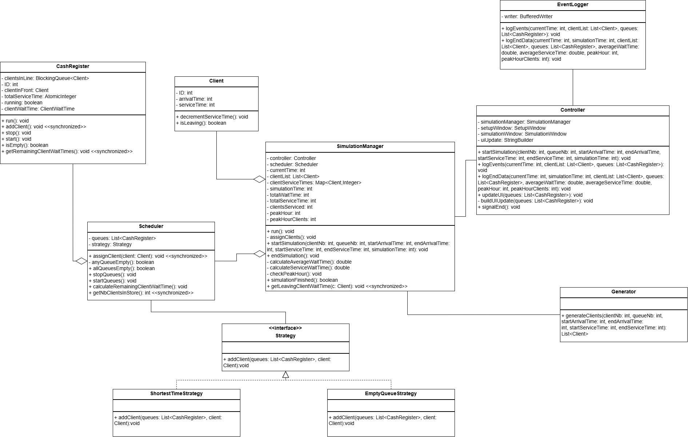
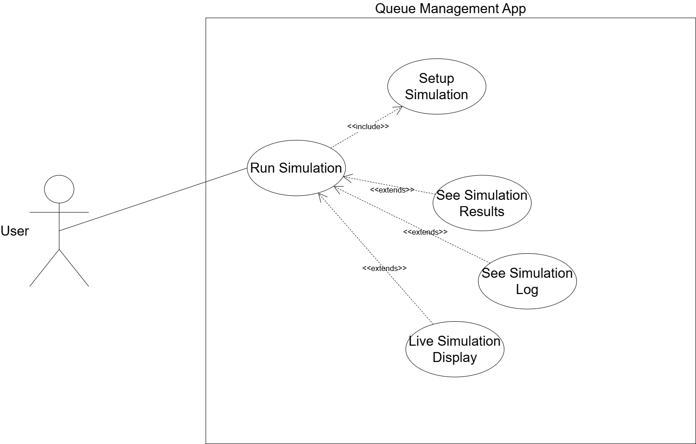
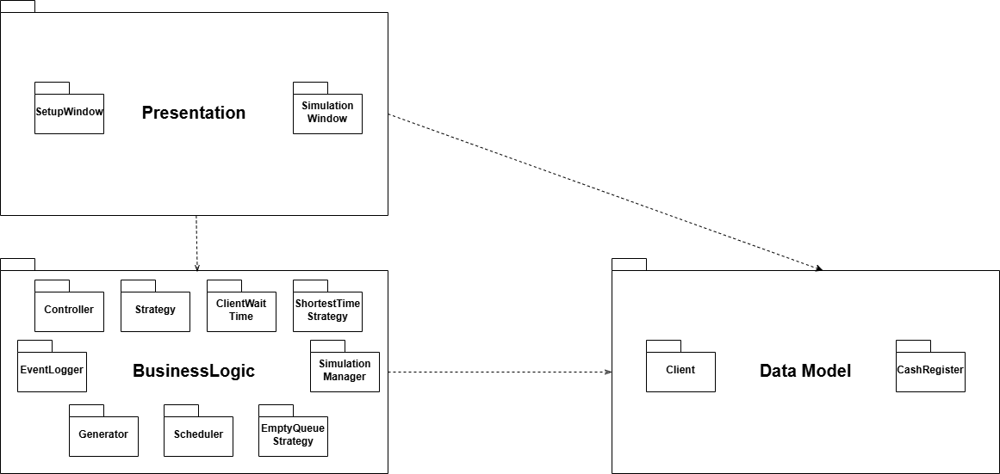

# Queue Simulation

A multithreaded desktop simulation of a store queue system built with Java Swing. Models clients arriving at a store and being assigned to cash register queues based on configurable strategies.

## Features

- Configure number of clients, queues, arrival time range, service time range, and simulation duration
- Clients are randomly generated with arrival and service times within the specified ranges
- Smart queue assignment: prefers empty queues, falls back to shortest wait time
- Real-time simulation view showing the state of each queue per second
- Peak hour detection (time with the most clients in store)
- Average wait time and average service time calculated at the end
- Full event log written to `log.txt` after each simulation

## Tech Stack

- **Language:** Java 23
- **GUI:** Java Swing
- **Build Tool:** Maven
- **Concurrency:** Java Threads, `LinkedBlockingQueue`, `AtomicInteger`

## Architecture

Built following a 3-layer architecture:

- `Presentation` — Swing UI (`SetupWindow`, `SimulationWindow`)
- `BusinessLogic` — Simulation engine (`SimulationManager`, `Scheduler`, `Controller`, strategies)
- `DataModels` — Core entities: `Client`, `CashRegister`

## Design Patterns Used

- **Strategy Pattern** — Queue assignment switches dynamically between `EmptyQueueStrategy` and `ShortestTimeStrategy`
- **MVC Pattern** — `Controller` decouples the simulation logic from the UI
- **Observer-like** — `ClientWaitTime` interface allows `CashRegister` threads to report back to `SimulationManager`

## Diagrams

### Class Diagram


### Use Case Diagram


### Package Diagram


## Getting Started

### Prerequisites

- Java 23+
- Maven

### Run

```bash
git clone https://github.com/YOUR_USERNAME/queue-simulation.git
cd queue-simulation
mvn clean install
mvn exec:java
```

## How It Works

1. Enter simulation parameters in the setup window
2. The simulation generates clients with random arrival and service times
3. Each second, clients whose arrival time matches the current time are assigned to a queue
4. Each `CashRegister` runs on its own thread, decrementing service times each second
5. When the simulation ends, statistics and a full log are saved to `log.txt`

## Project Structure

```
src/
└── main/
    └── java/
        ├── BusinessLogic/   # SimulationManager, Scheduler, Controller, Strategies
        ├── DataModels/      # Client, CashRegister
        └── Presentation/    # SetupWindow, SimulationWindow
docs/
    ├── class-diagram.png
    ├── use-case-diagram.png
    └── package-diagram.png
```
